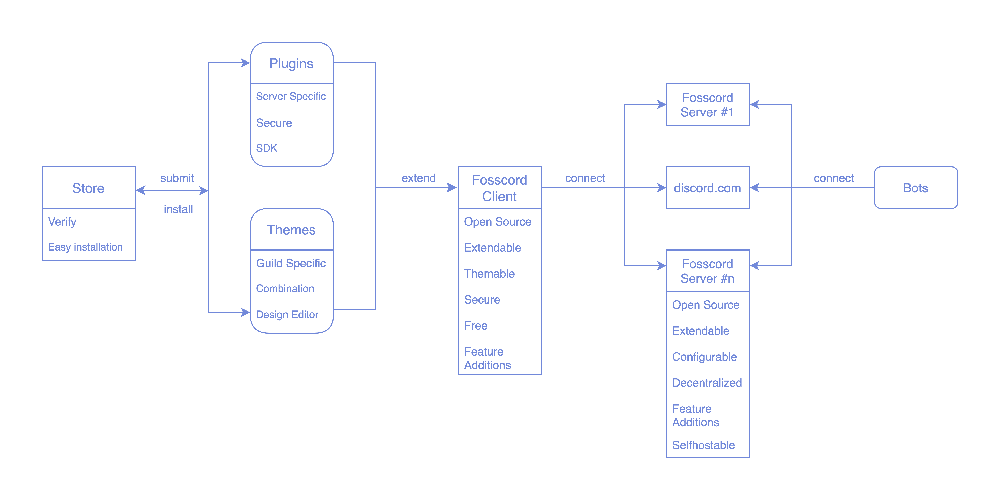

# Home

### What is the Spiders SMP?

A free to join Minecraft SMP! It is also the official SMP of SpideySpidery!

## How to officially join the SMP?

Create an Aternos account and then submit your username on this [FORM](https://my.forms.app/form/61fb787ded8dd61528302e3f). After that, you will have to wait for approval from the Server Admin. 
After your request is approved, you can login in Aternos and start the server to play whenever you want! You will officially be a member of the Spiders SMP! 
# You can also join the SMP as a guest user without doing the above mentioned things.

### Concept

### Why backwards compatible to Discord?

- Benefit from the large user base of discord -> more users, making the switch
  easier for new users & keeping workflows intact and easily migrating existing discord bots
- No disadvantage for the users who use fosscord, so that they can still
  communicate with all their peers who use discord
- Discord has already built a great and stable protocol _(don't reinvent the
  wheel)_
- The community can extend and customize their clients and servers by
  self-hosting them and developing and installing addons

## Support

[Discord server](https://discord.gg/ZrnGQP6p3d)

Once we are finished, we'll host our own instance to host the support server.
